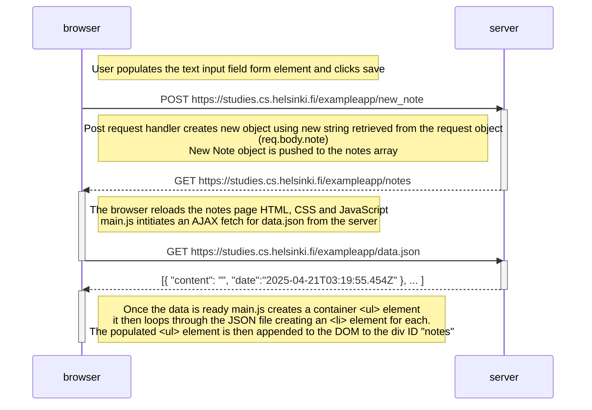

```mermaid
sequenceDiagram
    participant browser
    participant server

    Note right of browser: User populates the text input field form element and clicks save
    browser->>server: POST https://studies.cs.helsinki.fi/exampleapp/new_note
    activate server
    Note left of server: Post request handler creates new object using new string retrieved from the request object <br>(req.body.note)<br>New Note object is pushed to the notes array
    server-->>browser: GET https://studies.cs.helsinki.fi/exampleapp/notes
    deactivate server
    activate browser
    Note right of browser: The browser reloads the notes page HTML, CSS and JavaScript <br> main.js intitiates an AJAX fetch for data.json from the server
    browser->>server: GET https://studies.cs.helsinki.fi/exampleapp/data.json
    deactivate browser
    activate server
    server-->>browser: [{ "content": "", "date":"2025-04-21T03:19:55.454Z" }, ... ]
    deactivate server

    activate browser
    Note right of browser: Once the data is ready main.js creates a container <ul> element <br> it then loops through the JSON file creating an <li> element for each.<br>The populated <ul> element is then appended to the DOM to the div ID "notes"
    deactivate browser

```