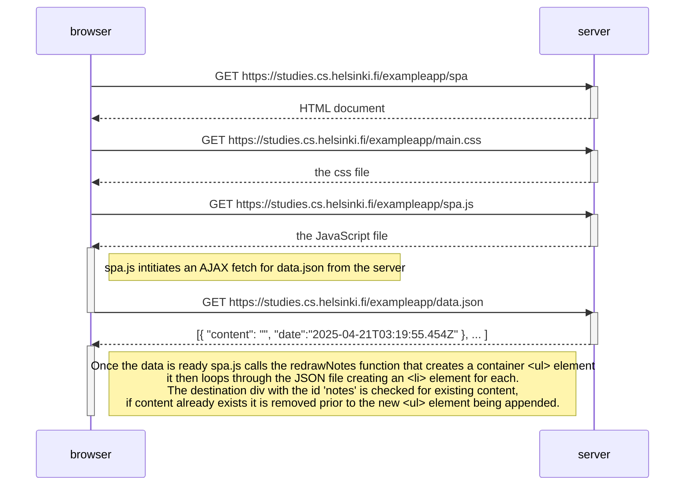

```mermaid
sequenceDiagram
    participant browser
    participant server

    browser->>server: GET https://studies.cs.helsinki.fi/exampleapp/spa
    activate server
    server-->>browser: HTML document
    deactivate server

    browser->>server: GET https://studies.cs.helsinki.fi/exampleapp/main.css
    activate server
    server-->>browser: the css file
    deactivate server

    browser->>server: GET https://studies.cs.helsinki.fi/exampleapp/spa.js
    activate server
    server-->>browser: the JavaScript file
    deactivate server
    activate browser
    Note right of browser: spa.js intitiates an AJAX fetch for data.json from the server
    browser->>server: GET https://studies.cs.helsinki.fi/exampleapp/data.json
    deactivate browser
    activate server
    server-->>browser: [{ "content": "", "date":"2025-04-21T03:19:55.454Z" }, ... ]
    deactivate server

    activate browser
    Note right of browser: Once the data is ready spa.js calls the redrawNotes function that creates a container <ul> element <br> it then loops through the JSON file creating an <li> element for each.<br>The destination div with the id 'notes' is checked for existing content,<br>if content already exists it is removed prior to the new <ul> element being appended.
    deactivate browser

```