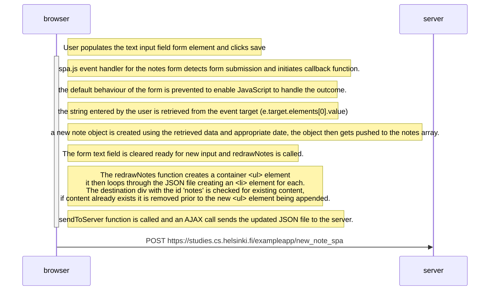

```mermaid
sequenceDiagram
    participant browser
    participant server

    Note right of browser: User populates the text input field form element and clicks save

    activate browser
    Note right of browser: spa.js event handler for the notes form detects form submission and initiates callback function.
    Note right of browser: the default behaviour of the form is prevented to enable JavaScript to handle the outcome.
    Note right of browser: the string entered by the user is retrieved from the event target (e.target.elements[0].value)
    Note right of browser: a new note object is created using the retrieved data and appropriate date, the object then gets pushed to the notes array.
    Note right of browser: The form text field is cleared ready for new input and redrawNotes is called.
    Note right of browser: The redrawNotes function creates a container <ul> element <br> it then loops through the JSON file creating an <li> element for each.<br>The destination div with the id 'notes' is checked for existing content,<br>if content already exists it is removed prior to the new <ul> element being appended.
    Note right of browser: sendToServer function is called and an AJAX call sends the updated JSON file to the server.
    deactivate browser
    browser->>server: POST https://studies.cs.helsinki.fi/exampleapp/new_note_spa

```